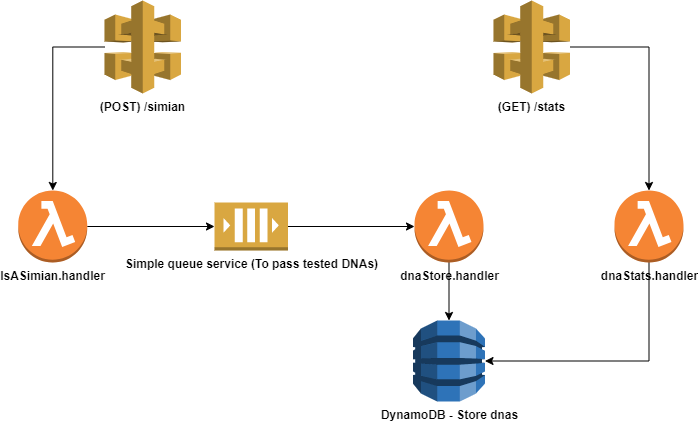

# Guia da aplicação

Essa aplicação foi construída utilizando JavaScript rodando na plataforma Node.JS.

## Infraestrutura



> A aplicação foi construída no modelo Serverless na plataforma Amazon Web Services (AWS).
> Essa decisão foi tomada para evitar custos, facilitar a entrega e dar maior visibilidade para as etapas do desafio.

Temos a divisão da aplicação entre 2 rotas no API Gateway, 3 Lambdas e 1 fila.

### Lambdas

- [isASimianHandler](./isASimianHandler): Cuida de todas as regras relacionadas de validação das matrizes. Também envia os resultados obtidos por fila para o lambda que cuidará da inserção.
- [dnaStoreHandler](./dnaStoreHandler): Responsável por receber os dados via fila do lambda [isASimianHandler](./isASimianHandler) e realizar a inserção na base de dados.
- [dnaStatsHandler](./dnaStatsHandler): Responsável por obter os dados inseridos pelo [dnaStatsHandler](./dnaStatsHandler) e gerar as estátisticas dos DNAS.

### Fila (Smple Queue Service)

- Responsável por transitar dados dos lambdas [isASimianHandler](./isASimianHandler)

### DynamoDB

- **dnaHuman**: Responsável por receber os DNAS de humanos;
- **dnaSimian**: Responsável por receber os DNAS do dos Simios.

### API Gateways

- **/simian**: Responsável por receber os DNAS e envia-los ao lambda [isASimianHandler](./isASimianHandler)
  - **Rota**: https://h4pv7hr9q1.execute-api.us-east-1.amazonaws.com/prod/simian
  - **Método**: POST
  - **Input**
  ```json
  {
    "dna": ["ATGCGA", "CAGTGC", "TTATGT", "AGAAGG", "CCCCTA", "TCACTG"]
  }
  ```
  - **Output**
  ```json
    {
      "statusCode": 200,
      "body": {
        "isASimianDNA": true
    }
  ```
- **/stats**: Responsável por retornar as estatísticas dos dados de DNA inseridos ao Dynamo pelo lambda [dnaStoreHandler](./dnaStoreHandler)
  - **ROTA**: https://h4pv7hr9q1.execute-api.us-east-1.amazonaws.com/prod/stats
  - **Método**: GET
  - **Output**
  ```json
  {
    "statusCode": 200,
    "body": {
        "count_mutant_dna": 3,
        "count_human_dna": 11,
        "ratio": 27.27272727272727
    }
  }
  ```