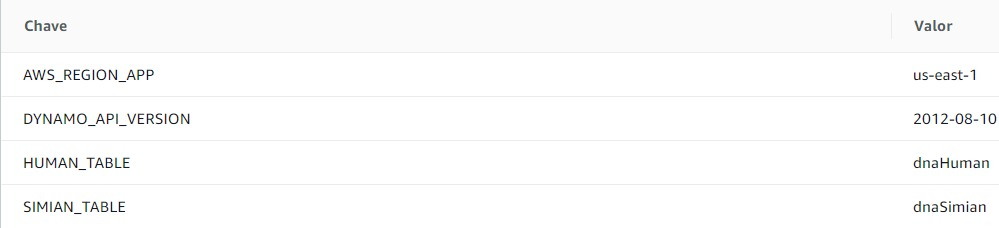

# Guia da aplicação - dnaStoreHandler
## Estrutura de pastas
```
.
├── app
|    ├── controllers                # Entrada de dados para a camada de regra de negócio e saída para o cliente
├── src
│   ├── core  
│       ├── config                  # Configurações de ferramentas
│       ├── models                  # Modelo de dados
│       ├── repository              # Repository pattern
│       ├── services                # Encapsula toda a regra de negócio
│       ├── utils                   # Regras de negócio em comum entre as partes da aplicação
├── test                            # Testes unitários
├── index.js                        # Entrada do handler da função lambda
├── README.md
└── package.json                    # Arquivo de dependências e informações gerais sobre o projeto
```
> Foi utilizado a arquitetura de 3 camadas.
## Instalação das dependências
```
$ npm install
```
## Testes

- **Testes de unidade**

```
$ npm test
```
- **Cobertura de testes**:

```
$ npm run coverage
```
- **LAMBDA ENV VARS**:

